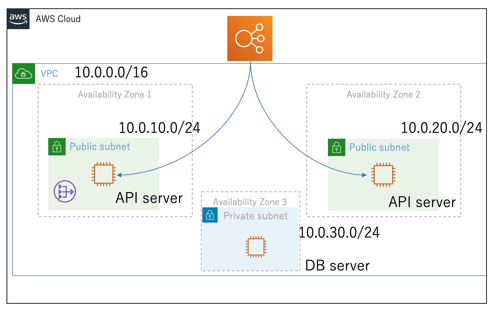

# todo-api

## Prerequisites
* python3.6
* pip3

## Set Up a Flask Application

```
$ git clone https://github.com/takapon564/todo-api.git

$ cd todo-api

$ pip3 install flask flask-restful flask-sqlalchemy pymysql 

```  

run the flask application  

```
$ python3 local_seup.py
```  

## System Architecture

